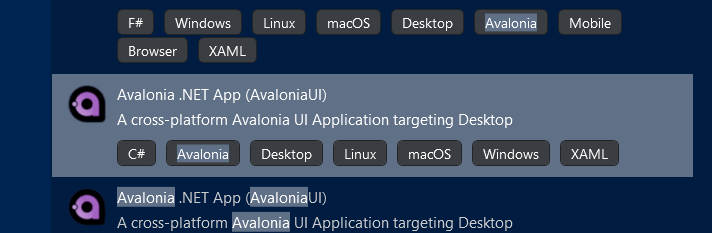

To use Caliburn.Micro with Avalonia UI use Visual Studio 2022 version 17.3 and install the Avalonia for Visual Studio 2022 extensions. You should also install the Avalonia UI and the AvaloniaUI templates.

### Step 1: Install Avalonia Templates

    dotnet new install Avalonia.Templates

### Step 2: Create a New Avalonia UI Project



### Step 3: Add Caliburn.Micro.Avalonia NuGet Package

Add the Caliburn.Micro.Avalonia NuGet package to your solution by running this command in the terminal:
```sh
    dotnet add package Caliburn.Micro.Avalonia --version 5.0.183-beta --source "https://nuget.pkg.github.com/caliburn-micro/index.json"
```

### Step 4: Create the Bootstrapper Class

Add a file Bootstrapper.cs class to the root of the project

    namespace AvaloniaApplication1
    {
         public class Bootstrapper : BootstrapperBase
        {
            private SimpleContainer _container = new SimpleContainer();

           public Bootstrapper()
           {
               Initialize();
           }

           protected override void Configure()
           {
               _container.Instance(_container);
               _container
                   .Singleton<IWindowManager, WindowManager>()
                   .Singleton<IEventAggregator, EventAggregator>();

               _container
                   .PerRequest<ShellViewModel>()
                   .PerRequest<MainViewModel>();
            }

            protected override async void OnStartup(object sender, ControlledApplicationLifetimeStartupEventArgs e)
            {
                await DisplayRootViewFor<ShellViewModel>();
            }

            protected override object GetInstance(Type service, string key)
            {
                 return _container.GetInstance(service, key);
            }

            protected override IEnumerable<object> GetAllInstances(Type service)
            {
                  return _container.GetAllInstances(service);
            }

            protected override void BuildUp(object instance)
            {
                _container.BuildUp(instance);
            }
        }

      }


#### Step 5: Update the App.axaml.cs file

The App.axaml.cs file needs to be updated to this

    public partial class App : Application
    {
        public override void Initialize()
        {
            AvaloniaXamlLoader.Load(this);
        }

        public override void OnFrameworkInitializationCompleted()
        {
            base.OnFrameworkInitializationCompleted();
            new Bootstrapper();
        }
    }


### Important Note

 You need to manually add the folder to the Namespace in both the .axaml and the code-behind file for .axaml.emplates](https://github.com/AvaloniaUI/avalonia-dotnet-templates/issues/235) where the folder is dropped from the Namespace for the axaml files.  Please Manually add the folder to the Namespace in the axaml and the code behind file for axaml.

