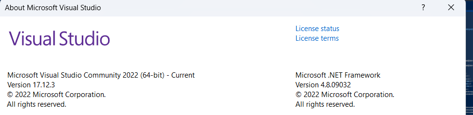
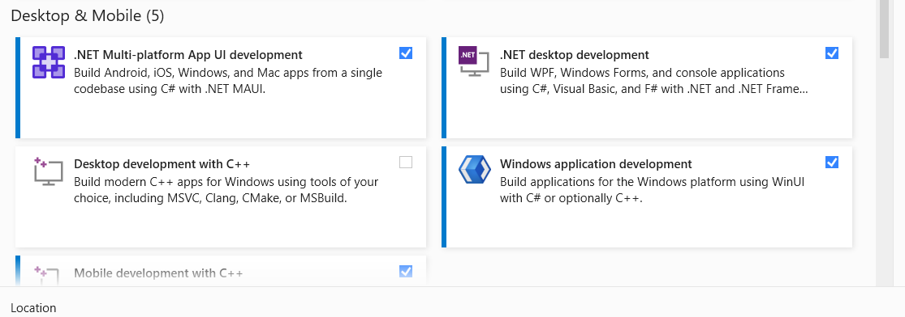

### Visual Studio 2022 Setup to compile Caliburn.Micro

## Version of Visual Studio I am currently using

Visual Studio 2022 community edition V17.12.3

## Workloads Required

- .net Multi-Platform Aoo UI Development
- .net Desktop Development
- Windows Application Development

## Extensions that can help

- Avalonia For Visual Studio 2022

