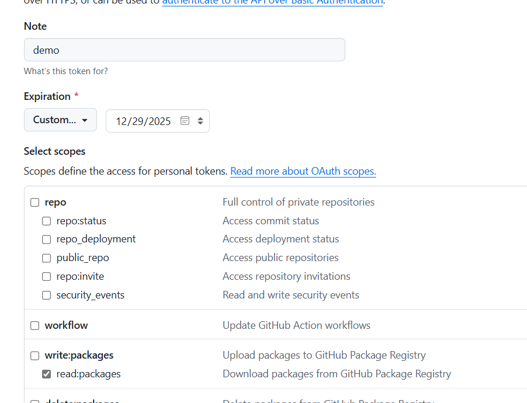

[NuGet][nuget] is a Visual Studio extension that makes it easy to add, remove, and update libraries and tools in Visual Studio projects that use the .NET Framework. Caliburn.Micro is proud to support the NuGet Package Manager.

### Installing the packages

With the latest version of Nuget installed, open the Package Manager Console and type:

```
PM> Install-Package Caliburn.Micro
```

### After installation

#### Clean out your App.xaml.cs file. It should look like this:

``` csharp
namespace YourNamespace
{
    using System.Windows;

    public partial class App : Application
    {
        public App()
        {
            InitializeComponent();
        }
    }
}
```

#### Add the AppBoostrapper to your App.xaml's Resources section.

##### WPF

``` xml
<Application xmlns="http://schemas.microsoft.com/winfx/2006/xaml/presentation"
             xmlns:x="http://schemas.microsoft.com/winfx/2006/xaml"
             xmlns:local="clr-namespace:YourNamespace"
             x:Class="YourNamespace.App">
    <Application.Resources>
        <ResourceDictionary>
            <ResourceDictionary.MergedDictionaries>
                <ResourceDictionary>
                    <local:AppBootstrapper x:Key="bootstrapper" />
                </ResourceDictionary>
            </ResourceDictionary.MergedDictionaries>
        </ResourceDictionary>
    </Application.Resources>
</Application>
```

**Note**: Make sure to remove the StartupUri value. Caliburn.Micro will be handling the main window creation for you. As a result, you no longer need the MainWindow.xaml either.


##### WinRT
For WinRT, the process of getting started is unfortunately quite different from the other platforms, due to significant design differences in the Windows Xaml APIs. For detailed instructions please see [Working with WinRT](./windows-runtime).


##### .net Maui
For .net Maui, the process of getting started is unfortunately quite different from the other platforms, due to significant design differences in the Windows Xaml APIs. For detailed instructions please see [Working with WinRT](./dotnet-maui.md).
[nuget]: http://www.nuget.org/


# Using Packages from the GitHub NuGet Feed

## Generating a Token

To use a GitHub NuGet package, you first need to generate a token with permissions to read packages.

1. Log in to GitHub.
2. Navigate to [this page](https://github.com/settings/tokens).

Select the **read:packages** permission. Typically, I set the expiration for a year, but you can choose whatever period suits you best.




## Add nuget source

 Once you generate the token you will use it in to call dotnet nuget

      dotnet nuget add source --username <Your username> --password <Your token Goes here> --store-password-in-clear-text --name "Caliburn.Micro github" "https://nuget.pkg.github.com/caliburn.micro/index.json"

Replace `<YourUsername>` with your username and `<Your Token Goes here>` with the token you just generated.  Feel free to change the name of the source.  

## Add the nuget package

To add a package to your project in the folder with the csproj  run the following command.

     add package Caliburn.Micro.Maui --version 5.0.183-beta --source "https://nuget.pkg.github.com/caliburn-micro/index.json"

[nuget]: http://www.nuget.org/
